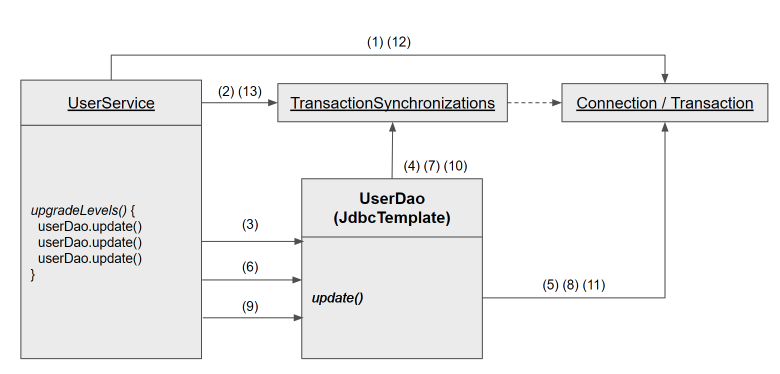

# 5장 서비스 추상화
## 사용자 레벨 관리 관리 기능 추가
### 필드 추가
- Level 이늄 : 안전하고 편리. 유효성 체크 추가.
- User 필드 추가
- UserDaoTest 테스트 수정
- UserDaoJdbc 수정 : level enum 타입은 DB 저장 불가
### 사용자 수정 기능 추가
- 수정 기능 테스트 추가
- UserDao와 UserDaoJdbc 수정
- 수정 테스트 보완
### UserService.upgradeLevels()
- UserService 클래스와 빈 등록
- UserServiceTest 테스트 클래스
- upgradeLevels() 메소드 : getAll() 대량 데이터 문제..
```java
public void upgradeLevels() {
        List<User> users = userDao.getAll();

        for (User user : users) {
            Boolean changed = null;

            if (user.getLevel() == Level.BASIC && user.getLoginCount() >= 50) {
                user.setLevel(Level.SILVER);
                changed = true;
            } else if (user.getLevel() == Level.SILVER && user.getRecommendCount() >= 30) {
                user.setLevel(Level.GOLD);
                changed = true;
            } else if (user.getLevel() == Level.GOLD) {
                changed = false;
            } else {
                changed = false;
            }

            if(changed) {
                userDao.update(user);
            }
        }
    }
```
- upgradeLevels() 테스트
### UserService.add()
### 코드 개선
- 코드에 중복된 부분은 없는가?
- 코드가 무엇을 하는 것인지 이해하기 불편하지 않은가?
- 코드가 자신이 있어야 할 자리에 있는가?
- 앞으로 변경이 일어난다면 어떤 것이 있을 수 있고, 그 변화에 쉽게 대응할 수 있게 작성된어 있는가?

- upgradeLevels() 메소드 코드의 문제점 : for 루프 if/elseif/else 불편 및 가독성 낮음
- upgradeLevels() 리펙토링 : 추상적인 레벨에서 작성
```java
public void upgradeLevels() {
   List<User> users = userDao.getAll();

   for (User user : users) {
      if(canUpgradeLevel(user)) {
          upgradeLevel(user);
      }
   }
}

private boolean canUpgradeLevel(User user) {
        Level currentLevel = user.getLevel();
        
        return switch(currentLevel) {
            case BASIC -> user.getLoginCount() >= 50;
            case SILVER -> user.getRecommendCount() >= 30;
            case GOLD -> false;
            default -> throw new IllegalArgumentException("Unknown Level: " + currentLevel);
        };
    }

private void upgradeLevel(User user) {
        Level currentLevel = user.getLevel();

        switch (currentLevel) {
            case BASIC -> user.setLevel(Level.SILVER);
            case SILVER -> user.setLevel(Level.GOLD);
            default -> throw new IllegalArgumentException("Can not upgrade this level: " + currentLevel);
        }

        userDao.update(user);
    }

```

```java
private void upgradeLevel(User user) {
        user.upgradeLevel();
        userDao.update(user);
    }

public void upgradeLevel() {
        Level nextLevel = this.level.nextLevel();

        if (nextLevel == null) {
           throw new IllegalStateException(this.level + "은 업그레이드가 불가능합니다.");
        } else {
            this.level = nextLevel;
        }
    }

```
- UserServiceTest 개선
## 트랜잭션 서비스 추상화
### 모 아니면 도
- 테스트용 UserService 대역
- 테스트 실패의 원인 : 트랜젝션
### 트랜잭션 경계설정
- JDBC 트랜잭션의 트랜잭션 경계설정 : local, global
- UserService와 UserDao의 트랜잭션 문제
- 비즈니스 로직 내의 트랜잭션 경계설정
```java
public void upgradeLevels() throws Exception {
  // (1) DB Connection 생성
  // (2) 트랜잭션 시작
  try {
    // (3) DAO 메소드 호출
    // (4) 트랜잭션 커밋
  }
  catch(Exception e) {
    // (5) 트랜잭션 롤백
    throw e;
  }
  finally {
    // (6) DB Connection 종료
  }
}
```
- UserService 트랜잭션 경계설정의 문제점 : connection 전달 필요
### 트랜잭션 동기화
- Connection 파라미터 제거



1. UserService가 Connection을 생성한다.
2. 생성한 Connection을 트랜잭션 동기화 저장소에 저장한다. 이후에 Connection의 setAutoCommit(false)를 호출해 트랜잭션을 시작시킨다.
3. 첫 번째 update() 메소드를 호출한다.
4. update() 메소드 내부에서 이용하는 JdbcTemplate은 트랜잭션 동기화 저장소에 현재 시작된 트랜잭션을 가진 Connection 오브젝트가 존재하는지 확인한다. ((2) 단계에서 만든 Connection 오브젝트를 발견할 것이다.)
5. 발견한 Connection을 이용해 PreparedStatement를 만들어 SQL을 실행한다. 트랜잭션 동기화 저장소에서 DB 커넥션을 가져왔을 때는 JdbcTemplate은 Connection을 닫지 않은채로 작업을 마친다. 이렇게 첫번째 DB 작업을 마쳤고, 트랜잭션은 아직 닫히지 않았다. 여전히 Connection은 트랜잭션 동기화 저장소에 저장되어 있다.
6. 동일하게 userDao.update()를 호출한다.
7. 트랜잭션 동기화 저장소를 확인하고 Connection을 가져온다.
8. 발견된 Connection으로 SQL을 실행한다.
9. userDao.update()를 호출한다.
10. 트랜잭션 동기화 저장소를 확인하고 Connection을 가져온다.
11. 가져온 Connection으로 SQL을 실행한다.
12. Connection의 commit()을 호출해서 트랜잭션을 완료시킨다.
13. Connection을 제거한다.

> 위 과정 중 예외가 발생하면, commit()은 일어나지 않고 트랜잭션은 rollback()된다

- 트랜잭션 동기화 저장소는 작업 스레드마다 독립적으로 Connection 오브젝트를 저장하고 관리하기 때문에 다중 사용자를 처리하는 서버의 멀티스레드 환경에서도 충돌이 날 염려는 없다.
- 트랜잭션 동기화 적용
```xml
<bean id="userService" class="toby_spring.user.service.UserService">
        <property name="userDao" ref="userDao" />
        <property name="dataSource" ref="dataSource" />
        <property name="userLevelUpgradePolicy" ref="userLevelUpgradePolicy" />
    </bean>
```
```java
 public void upgradeLevels() throws SQLException{
        // 트랜잭션 동기화 관리자를 이용해 동기화 작업을 초기화
        TransactionSynchronizationManager.initSynchronization();
        // DB 커넥션을 생성하고 트랜잭션을 시작한다.
        // 이후의 DAO 작업은 모두 여기서 시작한 트랜잭션 안에서 진행된다.
        // 아래 두 줄이 DB 커넥션 생성과 동기화를 함께 해준다.
        Connection c = DataSourceUtils.getConnection(dataSource);
        c.setAutoCommit(false);

        try {
            List<User> users = userDao.getAll();
            for (User user : users) {
                if (canUpgradeLevel(user)) {
                    upgradeLevel(user);
                }
            }

            c.commit();
        }catch(Exception e) {
            c.rollback();
            throw e;
        } finally {
            // 스프링 DataSourceUtils 유틸리티 메소드를 통해 커넥션을 안전하게 닫는다.
            DataSourceUtils.releaseConnection(c, dataSource);
            // 동기화 작업 종료 및 정리
            TransactionSynchronizationManager.unbindResource(this.dataSource);
            TransactionSynchronizationManager.clearSynchronization();
        }
    }
```

1. UserSevice DB커넥션을 DI 설정
1. TransactionSynchronizationManager 동기화 작업 초기화
1. DataSourceUtils 제공하는 getConnection 메소드를 통해 DB 커넥션을 생성
1. JdbcTemplate 동기화시킨 DB 커넥션을 사용 
1. UserDao를 통해 진행되는 모든 JDBC 작업은 upgradeLevels() 메소드에서 만든 Connection 오브젝트를 사용하고 같은 트랜잭션에 참여
1. 스프링 유틸리티 메소드의 도움을 받아 커넥션을 닫고 트랜젝션 마치도록 요청하면 된다.
- 트랜잭션 테스트 보완 : DataSource DI 처리
  - JdbcTemplate과 트랜잭션 동기화
  - try/catch/finally 작업 흐름 지원
  - SQLException 예외 변환
  - 트랜잭션 동기화 관리
### 트랜잭션 서비스 추상화
- 기술과 환경에 종속되는 트랜잭션 경계설정 코드
  - 애플리케이션은 기존의 방법대로 DB는 JDBC, 메시징 서버라면 JMS 같은 API를 사용해서 필요한 작업을 수행한다.
  - 단, 트랜잭션은 JDBC나 JMS API를 사용하여 직접 제어하지 않고, JTA(Java Transaction API)를 통해 트랜잭션 매니저가 관리하도록 위임한다.
  - 트랜잭션 매니저는 DB와 메시징 서버를 제어하고 관리하는 각각의 리소스 매니저와 XA 프로토콜을 통해 연결된다.
```java
// JNDI를 이용해 서버의 Transaction 오브젝트를 가져온다.
InitialContext ctx = new InitialContext();
UserTransaction tx = (UserTransaction)ctx.lookup(USER_TX_JNDI_NAME);

tx.begin();
// JNDI(Java Naming and Directory Interface)로 가져온 dataSource를 사용해야 한다.
Connection c = dataSource.getConnection();
try {
  // 데이터 액세스 코드
  tx.commit();
} catch (Exception e) {
  tx.rollback();
  throw e;
} finally {
  c.close();
}
```
- 트랜잭션 API의 의존관계 문제와 해결책
> 이렇게 여러 기술의 사용 방법에 공통점이 있다면 추상화를 생각해볼 수 있다. 추상화란 하위 시스템의 공통점을 뽑아내서 분리시키는 것을 말한다. 트랜잭션 코드에도 추상화를 도입해보자. JDBC, JTA, 하이버네이트, JPA, JDO 심지어 JMS도 트랜잭션 개념을 갖고 있으니 트랜잭션 경계설정 방법에서 공통점이 있을 것이며 공통적인 특징을 모아서 추상화된 트랜잭션 관리 계층을 만들 수 있을 것이다.
```java
public class UserService {
    UserDao userDao;
    DataSource dataSource;
    PlatformTransactionManager transactionManager;
    ...
```
```java
public void upgradeLevels() {
        // 트랜잭션 시작
        TransactionStatus status =
                transactionManager.getTransaction(new DefaultTransactionDefinition());

        try {
            List<User> users = userDao.getAll();
            for (User user : users) {
                if (canUpgradeLevel(user)) {
                    upgradeLevel(user);
                }
            }

            transactionManager.commit(status);
        }catch(Exception e) {
            transactionManager.rollback(status);
            throw e;
        }
    }
```
```xml
<bean id="transactionManager" class="org.springframework.jdbc.datasource.DataSourceTransactionManager">
        <property name="dataSource" ref="dataSource" />
    </bean>

    <bean id="userService" class="toby_spring.user.service.UserService">
        <property name="transactionManager" ref="transactionManager"/>
        <property name="userDao" ref="userDao" />
        <property name="dataSource" ref="dataSource" />
        <property name="userLevelUpgradePolicy" ref="userLevelUpgradePolicy" />
    </bean>
```

- 트랜잭션 기술 설정의 분리
   - 이제는 JTA나 Hibernate 등으로 트랜잭션을 적용해도 UserService의 코드는 변경될 필요가 없다. 단순히 빈에 주입하는 DI만 다른 클래스로 바꿔주면 된다.
```xml
<bean id="transactionManager" class="org.springframework.jdbc.datasource.DataSourceTransactionManager">
        <property name="dataSource" ref="dataSource" />
    </bean>

    <bean id="userService" class="toby_spring.user.service.UserService">
        <property name="transactionManager" ref="transactionManager"/>
        <property name="userDao" ref="userDao" />
        <property name="userLevelUpgradePolicy" ref="userLevelUpgradePolicy" />
    </bean>
```
## 서비스 추상화와 단일 책임 원칙
- 수식, 수평 계층구조와 의존 관계
  - UserService, UserDao는 애플리케이션의 로직을 담으므로 애플리케이션 계층이다.
  - UserDao는 데이터 등록, 조회 등 데이터 액세스에 대한 로직을 담는다.
  - UserServce는 사용자 관리 업무의 비즈니스 로직을 담는다.
  - UserDao와 UserService는 인터페이스와 DI를 통해 연결됨으로써 결합도가 낮아졌다.
- 단일 책임 원칙
> 단일 책임 원칙이란, 하나의 모듈은 한가지 책임을 가져야 한다는 의미다. 다른 말로 풀면 하나의 모듈이 바뀌는 이유는 한가지여야 한다고 설명할 수도 있다.
  - 사용자 관리 로직이 바뀌거나 추가되지 않는 한 UserService의 코드에 손댈 일이 없어졌다. 따라서 이제는 단일 책임 원칙을 훌륭하게 지키고 있다고 말할 수 있다.
- 단일 책임 원칙의 장점
  - 변경사항에 따른 로직 수정이 적다
> 적절하게 책임과 관심이 다른 코드를 분리하고, 서로 영향을 주지 않도록 다양한 추상화 기법을 도입하고, 애플리케이션 로직과 기술/환경을 분리하는 등의 작업은 갈수록 복잡해지는 엔터프라이즈 애플리케이션에는 반드시 필요하다. 이를 위한 핵심적인 도구가 바로 스프링이 제공하는 DI다.

## 메일 서비스 추상화
### JavaMail을 이용한 메일 발송 기능
- 사용자의 이메일 정보를 관리해야함
  - DB에 email 필드 추가
  - User 클래스에 email 프로퍼티 추가
  - UserDao의 UserMapper와 insert(), update()에 email 필드 처리
  - UserDaoTest 수정
```java
public class UserService {
    protected void upgradeLvl(User user) {
        user.upgradeLvl();
        userDao.update(user);
        sendUpgradeEmial(user);
    }

    private void sendUpgradeEmial(User user) {
        Properties props = new Properties();
        props.put("mail.smtp.host", "mail.ksug.org");
        Session s = Session.getInstance(props, null);

        MimeMessage message = new MimeMessage(s);
        try {
            message.setFrom(new InternetAddress("useradmin@ksug.org"));
            message.setRecipient(Message.RecipientType.TO, new InternetAddress(user.getEmail()));
            message.setSubject("Upgrade 안내");
            message.setText("사용자님의 등급이 " + user.getLvl().name() + "로 업그레이드되었습니다.");

            Transport.send(message);
        } catch (AddressException e) {
            throw new RuntimeException(e);
        } catch (MessagingException e) {
            throw new RuntimeException(e);
        }
    }
}
```
### JavaMail이 포함된 코드의 테스트
메일 서버가 준비되어 있지 않다면?
테스트는 실패
```java
java.lang.RuntimeException: javax.mail.MessagingException: Could not connect to SMTP host: mail.ksug.org, port: 25;
```
테스트를 하면서 매번 메일을 발송되게 하는 것이 바람직한가?

메일 발송 작업은 부하가 큰 작업
사용자 레벨 업그레이드 작업의 보조적인 기능에 불과
메일 서버를 사용하지 않고 테스트 메일 서버를 이용해야 한다.

JavaMail과 연동해서 메일 전송 요청을 받는 것까지만 담당
JavaMail을 사용하지 않고, 테스트용 JavaMail을 이용한다면 JavaMail을 직접 구동시킬 필요도 없다.

운영시에는 JavaMail을 이용
테스트 시에는 JavaMail을 이용할 때와 동일한 인터페이스를 갖는 코드가 동작하도록

### 테스트를 위한 서비스 추상화
- JavaMail을 이용한 테스트의 문제점
  - 문제는 JavaMail의 API는 이 방법을 적용할 수 없다.
  - 싱글톤으로 구현되어 있는 Session은 인터페이스가 아닌 클래스이며, 생성자 역시 private으로 선언되어 직접 생성도 불가
  - JavaMail : 확장이나 지원이 불가능 
  - 포기할까? No, 서비스 추상화를 이용하면 됨
  - 서비스 추상화 : 테스트하기 힘든 구조의 API를 테스트하기 좋게 만드는 방법을 제공
### 메일 발송 기능 추상화
```java
public interface MailSender {
    void send(SimpleMailMessage simpleMessage) throws MailException;
    void send(SimpleMailMessage[] simpleMessages) throws MailException;
}
```
```java
public class UserService {
    private void sendUpgradeEmial(User user) {
        JavaMailSenderImpl mailSender = new JavaMailSenderImpl();
        mailSender.setHost("mail.server.com");

        SimpleMailMessage mailMessage = new SimpleMailMessage();
        mailMessage.setTo(user.getEmail());
        mailMessage.setFrom("useradmin@ksug.org");
        mailMessage.setSubject("Upgrade 안내");
        mailMessage.setText("사용자님의 등급이 " + user.getLvl().name() + "로 업그레이드되었습니다.");

        mailSender.send(mailMessage);
    }
}
```
스프링 DI 적용
```java
public class UserService {
    // ...

    private MailSender mailSender;

    public void setMailSender(MailSender mailSender) {
        this.mailSender = mailSender;
    }

    private void sendUpgradeEMail(User user) {
        SimpleMailMessage mailMessage = new SimpleMailMessage();
        mailMessage.setTo(user.getEmail());
        mailMessage.setFrom("useradmin@ksug.org");
        mailMessage.setSubject("Upgrade 안내");
        mailMessage.setText("사용자님의 등급이 " + user.getLvl().name() + "로 업그레이드되었습니다.");

        this.mailSender.send(mailMessage);
    }
}
```
```xml
<bean id="userService" class="com.david.tobysspring.user.service.UserService">
    <property name="userDao" ref="userDao" />
    <property name="transactionManager" ref="transactionManager" />
    <property name="mailSender" ref="mailSender" />
</bean>

<bean id="mailSender" class="org.springframework.mail.javamail.JavaMailSenderImpl">
    <property name="host" value="mail.server.com" />
</bean>
```
- 테스트용 메일 발송 오브젝트
mailSender 빈의 host 프로퍼티에 메일 서버를 지정

  - 테스트 실행 시 지정된 메일 서버로 메일이 발송됨
JavaMail을 사용하고 싶지 않아!
  - 테스트 메일 전용 클래스 생성
  - MailSender 인터페이스를 구현
  - 테스트 시에는 메일이 발송될 필요가 없음 (빈 클래스를 구현)
```java
public class UserServiceTest {
    static class DummyMailSender implements MailSender {
        @Override
        public void send(SimpleMailMessage simpleMessage) throws MailException {
        }

        @Override
        public void send(SimpleMailMessage... simpleMessages) throws MailException {
        }
    }
}
```
DummyMailSender 역시 테스트에서만 사용할 것이므로 내부 클래스로 정의했다.
설정 파일도 DummyMailSender로 변경해준다.
  - 내부 클래스를 참조할 때는 '$' 를 사용한다.
  - host는 더 이상 필요 없으므로 프로퍼티를 삭제해준다.
```xml
<bean id="mailSender" class="com.david.tobysspring.user.service.UserServiceTest$DummyMailSender" />
```
UserServiceTest에서는 수동 DI를 해주어야 한다.
```java
public class UserServiceTest {
    @Autowired MailSender mailSender;

    @Test
    public void upgradeAllOrNothing() throws Exception {
        // ...
        testUserService.setMailSender(mailSender);
        // ...
    }
}
```
UserServiceTest 테스트는 성공적으로 끝난다.
  - 메일이 실제로 발송될 일은 없다.
  - 메일 전송 메소드가 호출됐는지 확인해보려면 발송정보를 콘솔에 찍어보는 방법이 있다.
- 테스트와 서비스 추상화
서비스 추상화
  - 일반적으로 기능은 유사하나 사용 방법이 다른 로우레벨의 다양한 기술에 대해 일관성 있는 접근 방법을 제공하는 것을 의미
  - JavaMail과 같이 테스트를 어렵게 만드는 API를 사용할 때도 유용하게 사용됨
  - JavaMail이 아닌 다른 메세징 서버의 API를 이용하는 경우에도 MailSender 구현 클래스를 만들어서 DI 해주면 됨
비즈니스 로직이 바뀌지 않는 한 UserService는 수정할 필요가 없음
문제점 : 트랜잭션 개념이 빠져있음
  - 레벨 업그레이드에 트랜잭션이 적용되어 있으므로 메일 발송 기능에도 트랜잭션을 적용해야 함
     - 발송 대상을 별도의 목록에 저장 : 사용자 관리 비즈니스 로직과 메일 발송 트랜잭션 기술 부분이 섞임
     - MailSender를 확장해서 메일 전송에 트랜잭션 개념을 적용 : 서로 다른 종류의 작업을 분리해 처리가 가능

