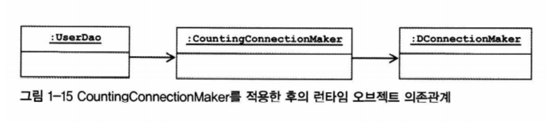

# AOP
- IoC/DI, 서비스추상화와 함께 스프링의 3대 기반기술 중 하나입니다.
- AOP를 이용해 얻을 수 있는 이점과, 스프링에서 AOP를 적용할 수 있는 대표적 대상인 선언적 트랜잭션에 대해 소개합니다.


## 트랜잭션 코드의 분리

5장에서 서비스 추상화 기법을 적용해, 특정 기술에 의존하지 않는 트랜잭션 경계설정 코드를 작성했습니다. 

그러나, '특정 기술에 의존하지 않도록'하는 것에는 성공했으나, 여전히 '트랜잭션 경계설정 코드'가 비즈니스 로직과 함께 존재하는 상황이 찝찝합니다.

비즈니스 로직이 주관심사인 메소드 안에, 트랜잭션 경계설정 코드가 붙어있기 때문에 핵심 관심사를 파악하는 데 방해될 뿐더러, 유사한 경계설정 코드가 많은 서비스메소드에 걸쳐 중복될 수 있습니다.


부가적인 관심사라고 볼 수 있는 '트랜잭션 경계 설정'코드를 비즈니스로직을 담당하는 UserService클래스에서 빼내어야 합니다.


## 옵션1) DI 적용 + 프록시를 이용한 데코레이터 패턴 적용

1장에서 의존관계 주입의 응용방안에 대해 설명하면서(1.7.4), 기능 구현의 교환과 더불어 **부가기능추가**에 대해 소개했었습니다.

DAO가 ConnectionMaker의 makeConnection()메소드를 호출할 때마다, 그 횟수를 카운팅하는 기능을 추가하고자 했을 때 DI를 이용하지 않는다면, 일일이 makeConnection 호출부를 찾아내어 카운팅 로직을 삽입하거나 카운팅이라는 부가기능을 makeConnection메소드 구현에 덕지덕지 붙여야 할지도 모릅니다.

그러나 DI를 활용한다면, 각 DAO는 ConnectionMaker라는 interface를 통해 카운팅이라는 부가기능만 수행하는 프록시에 의존하도록 하고, 이 프록시가 실제 주기능을 외부 target class에 위임하도록 관계설정만 조정함으로써 객체지향적 확장이 가능합니다.



  
이 사례를 그대로 트랜잭션 경계설정 기능에 적용해 볼 수 있습니다.


이를 좀 더 일반화하면 다음 그림과 같은 형태입니다.


- 부가기능을 구현한 클래스는 핵심기능 클래스와 같은 인터페이스를 구현합니다.
- 부가기능 클래스는, 오직 부가기능만을 수행하고 그 외의 모든 기능은 핵심기능을 가진 클래스로 위임해야 합니다.(부가기능이 핵심기능을 사용하는 구조)
- 부가기능 클래스는 클라이언트에게 마치 자신이 핵심기능 클래스인 것처럼 위장하여, 클라이언트가 자신을 거쳐서 핵심기능을 사용하도록 해야 합니다.
- 이렇게 마치 자신이 클라이언트가 사용하고자 하는 실제 대상인 것처럼 위장하여 대신 요청을 받는 오브젝트를 ***프록시*** 라고 합니다.

> ### 프록시의 사용 목적에 따른 구분
> **1. 데코레이터 패턴**
> 	- 타깃에 부가적인 기능을 런타임시 다이나믹하게 부여하는 것을 목적으로 프록시를 사용하는 패턴입니다.
> 	- 다이나믹하다는 의미는, 코드상에서는 어떤 방법과 순서로 프록시와 타깃이 연결되는지 정해지지 않는다는 뜻으로, 프록시가 타깃이 아닌 또다른 프록시에 의존하기도 합니다.
> 	- 이러한 단계적 위임(프록시 -> 프록시 -> ... -> 타깃)을 통해, 여러 관점의 부가기능을 동적으로 덧붙일 수 있습니다.  
> 
> **2. 프록시 패턴**
> 	- 부가기능 추가가 아닌, 타깃에 대한 '접근방식'을 변경하는 것을 주목적으로 프록시를 활용하는 패턴입니다.
> 	- 타깃 오브젝트를 실제로 생성/호출하는 비용이 비싸 지연로딩 및 캐싱하거나, 쓰기/삭제와 같은 특정 기능에 대한 접근제한을 부여하기 위해 활용될 수 있습니다.

- 트랜잭션 경계설정 코드의 분리는 '부가기능'을 추가하기 위한 관점에서 프록시를 활용하고 있으므로, 데코레이터 패턴의 응용으로 볼 수 있습니다.

### 이러한 분리작업으로 얻을 수 있는 이점
- 비즈니스 로직을 담당하고 있는 타깃 코드를 작성할 때는, 트랜잭션과 같은 기술적 내용에 전혀 신경쓰지 않아도 됩니다.
- 비즈니스 로직에 대한 테스트를 작성할 때, 트랜잭션과 관련된 의존성을 제외할 수 있으므로 테스트작성이 보다 손쉽습니다.

### 여전히 가지고 있는 한계
- 프록시는 기존 코드에 영향을 주지 않고 타깃의 기능을 확장하거나, 접근방법을 제어할 수 있는 유용한 방법이지만, 프록시를 만드는 일 자체가 개발자에게 번거롭게 느껴집니다.
- 1장에서 예로 들었던 CountingConnectionMaker(커넥션을 반환하는 타깃 앞에, 커넥션 횟수를 카운팅하는 부가기능 프록시를 둔 형태)에서, 프록시 생성작업이 그다지 번거롭게 느껴지지 않았던 이유는 타깃클래스가 하나인데다 프록싱할 타깃메소드도 하나였기 때문입니다. 만약, 트랜잭션 경계설정과 같이 Service Layer의 거의 모든 클래스와 메소드에 대한 프록시를 만들어야한다면 프록시를 작성하는 일 자체가 불편해집니다.


## 옵션2) 다이나믹 프록시 활용
부가기능 코드는 타깃과 무관하게 고정되어 있으며, 타깃클래스와 동일한 인터페이스를 구현하는 프록시클래스를 만들고 각 메소드가 부가기능 코드 + 타깃 메소드 위임 코드로 이루어지도록 하는 작업은 반복적입니다. 이를 자동화할 수 있는 방안이 있다면 프록시 활용의 장점은 가지되, 반복적인 프록시 클래스 작성이라는 단점은 없앨 수 있습니다.
리플렉션과 다이나믹 프록시를 활용하면 이러한 반복적인 작업을 줄일 수 있습니다. 


> **리플렉션**
> - 자바의 코드 자체를 추상화해서 그 정보에 접근할 수 있도록 만든 API입니다.
> - 모든 클래스는 그 클래스 자체의 메타정보를 담은 Class타입의 오브젝트를 하나씩 가지고 있습니다.
> - 리플렉션을 이용하면, 특정 클래스 안에 어떤 멤버변수와 메소드들이 있는지, 각 메소드들의 리턴 타입과 파라미터에 대한 정보를 런타입에 얻어낼 수 있고, 심지어 이렇게 얻어낸 메소드 정보를 이용하여 실제로 특정 오브젝트의 메소드를 실행할 수도 있습니다.

```java
package springbook.learningtest.jdk;
...
public class ReflectionTest {
	@Test
    public void invokeMethod() throws Exception() {
        String name = "Spring";
        
        // length()
        assertThat(name.length(), is(6));
        
		Method lengthMethod = String.class.getMethod("length");
        assertThat((Integer)lengthMethod.invoke(name), is(6));
        
        // charAt()
        assertThat(name.charAt(0), is('S'));
        
        Method charAtMethod = String.class.getMethod("charAt", int.class);
        assertThat((Character)charAtMethod.invoke(name, 0), is('S'));
    }
}
```

다이나믹 프록시는 이러한 JAVA reflection API를 이용하여 만들어집니다.


다이나믹 프록시는 프록시 팩토리에 의해 런타임시 다이나믹하게 만들어지는 오브젝트이며, 개발자가 일일이 인터페이스를 모두구현해가면서 클래스를 정의하는 수고를 덜 수 있도록 해줍니다.

프록시 팩토리에게 타깃클래스의 인터페이스 정보를 제공해주면 해당 인터페이스를 구현하는 클래스의 오브젝트를 자동으로 만들어 줍니다.


이때 추가적으로 제공해야할 정보는 프록시에 넣을 부가기능 코드입니다. 부가기능 코드는 InvocationHandler인터페이스를 구현한 오브젝트의 invoke메소드에 담으며, 이 구현체를 프록시팩토리에게 타깃 인터페이스 타입정보와 함께 넘겨 다이나믹 프록시를 생성하게 됩니다.

생성된 다이나믹 프록시가 받는 모든 요청은, 함께 전달한 InvocationHanlder의 invoke()메소드로 전달됩니다.


위 그림과 같이 모든 요청이 InvocationHandler의 invoke()메소드를 거치므로, invoke메소드 안에 타깃의 어떤 메소드에 어떤 기능을 적용할지 선택하는 과정이 필요할 수 있습니다.
예를 들어, 메소드명에 특정 단어가 들어가는 경우에 한해 부가기능을 수행하거나, 메소드에 특정 어노테이션이 달려있을 경우에만 부가기능이 수행되도록 할 수 있습니다.
 
트랜잭션 부가기능 예시에서, 다이나믹 프록시를 활용한다면 각 Service 인터페이스의 메소드를 모두 구현하는 프록시를 작성할 필요 없이, 부가기능을 가진 InvocationHandler를 하나만 정의하여 이를 여러 타깃클래스의 부가기능으로 손쉽게 등록할 수 있습니다.

```java
public class TransactionHandler implements InvocationHandler {
    private Object target;
    private PlatformTransactionManager platformTransactionManager;
    private String pattern;

    public void setTarget(Object target) {
        this.target = target;
    }

    public void setTransactionManager(PlatformTransactionManager platformTransactionManager) {
        this.platformTransactionManager = platformTransactionManager;
    }

    public void setPattern(String pattern) {
        this.pattern = pattern;
    }

    public Object invoke(Object proxy, Method method, Object[] args) throws Throwable {
        if (method.getName().startsWith(pattern)) { // 부가기능 적용대상 선별
            return invokeInTransaction(method, args); // 부가기능 적용
        } else {
            return method.invoke(target, args);
        }
    }

    private Object invokeInTransaction(Method method, Object[] args) throws Throwable {
        TransactionStatus status = this.platformTransactionManager.getTransaction(new DefaultTransactionDefinition());

        try {
            Object ret = method.invoke(target, args); // 핵심기능 위임
            this.platformTransactionManager.commit(status);
            return ret;
        } catch (InvocationTargetException e) {
            this.platformTransactionManager.rollback(status);
            throw e.getTargetException();
        }
    }
}
```
[트랜잭션 부가기능을 가지고있는 InvocationHandler 구현체]
- 요청을 위임할 타깃을 DI로 제공받음으로써, UserServiceImpl클래스 외에도 어떠한 타깃 오브젝트에도 적용할 수 있습니다.
- 트랜잭션 적용을 위해, 트랜잭션 추상화 인터페이스인 PLATformTransactionManager또한 DI받습니다.
- 타깃 오브젝트의 모든 메소드에 무조건 트랜잭션이 적용되지 않도록 하기 위해, 트랜잭션을 적용할 메소드 이름의 패턴 또한 DI받습니다(이름 패턴이 아니더라도 어노테이션 기반 등의 다른 선별기준을 구현할 수도 있습니다)
- invoke()메소드의 구현은 크게 
	1. 부가기능 적용대산 선별
	2. 부가기능 수행
	3. 타깃에게 핵심기능 위임
	
	으로 이루어집니다.


### 다이나믹 프록시를 위한 팩토리 빈

다이나믹 프록시를 활용하여 반복적으로 프록시 클래스를 작성할 수고를 덜었습니다.

이제 이 프록시가 마치 실제 타깃인 것처럼 스프링 빈으로 등록되어야합니다. 그렇지 않으면 결국 클라이언트에서 트랜잭션 부가기능이 없는 타깃을 직접 사용하게 되기 때문입니다.

Controller에서 UserService타입의 빈을 요청했는데, 이때 어플리케이션 컨텍스트가 트랜잭션 부가기능을 가지고 있는 UserService타입의 프록시 오브젝트를 주지 않고, 타깃 클래스를 직접 준다면 이때까지 했던 작업들이 무의미해집니다.

부가기능을 가진 다이나믹 프록시 오브젝트가 마치 타깃인양 스프링 빈팩토리에 등록되고, 누군가가 특정 타입의 빈을 요청했을시 타깃 대신 반환되어야합니다.

그러나, 이때까지 소개했던 빈등록 방식(xml에 빈네임과 클래스 지정)으로는 다이나믹 프록시가 빈으로 등록되게 할 수 없습니다. 스프링은 내부적으로 리플렉션 API를 이용해서 빈정의에 나오는 클래스 이름을 이용해 빈 오브젝트를 생섭합니다.(해당 클래스의 생성자 또한 리플렉션으로 호출할 수 있습니다) 그러나 코드작성시점에 다이나믹 프록시 오브젝트의 클래스 정보를 미리 알아내어 빈에 정의할 방법이 없습니다.

그래서 특정 클래스의 생성자를 직접 이용하여 빈을 등록하는 방법 대신, 팩토리 빈을 이용해 간접적으로 빈을 생성하는 방법을 이용해야 합니다.

팩토리 빈을 만드는 가장 간단한 방법으로는 FactoryBean 인터페이스를 구현한 팩토리 클래스를 작성하는 것입니다.


```java
package org.springframework.beans.factory;

public interface FactoryBean<T> {
 // 빈 오브젝트를 생성해서 돌려준다.
    T getObject() throws Exception;
 // 생성되는 오브젝트의 타입을 알려준다.
    Class<?> getObjectType();
 // getObject()가 돌려주는 오브젝트가 항상 같은 싱글톤 오브젝트인지 알려준다.
    boolean isSingleton();
}
```

트랜잭션 부가기능을 위한 예제에서는 다음과 같은 FactoryBean을 작성하면 됩니다.

```java
public class TxProxyFactoryBean implements FactoryBean<Object> {
	Object target; // 타깃 오브젝트가 주입됨
	PlatformTransactionManager transactionManager;
	String pattern; // 부가기능 적용대상 선별을 위한 패턴
	Class<?> serviceInterface; // 다이내믹 프록시를 생성할 때 필요하다. UserService 외의 인터페이스를 가진 타깃에도 적용할 수 있다.
	
	public void setTarget(Object target) {
		this.target = target;
	}

	public void setTransactionManager(PlatformTransactionManager transactionManager) {
		this.transactionManager = transactionManager;
	}

	public void setPattern(String pattern) {
		this.pattern = pattern;
	}

	public void setServiceInterface(Class<?> serviceInterface) {
		this.serviceInterface = serviceInterface;
	}

	// FactoryBean 인터페이스 구현 메소드
	public Object getObject() throws Exception {
		TransactionHandler txHandler = new TransactionHandler();
		txHandler.setTarget(target);
		txHandler.setTransactionManager(transactionManager);
		txHandler.setPattern(pattern);
		return Proxy.newProxyInstance(
			getClass().getClassLoader(),new Class[] { serviceInterface }, txHandler);
	}

	// 팩토리 빈이 생성하는 오브젝트의 타입은 DI 받은 인터페이스의 타입에 따라 달라진다.
	// 따라서 다양한 타입의 프록시 오브젝트 생성에 재사용 할 수 있다.
	public Class<?> getObjectType() {
		return serviceInterface;
	}

	// 싱글톤 빈이 아니라는 뜻이 아니라 getObject()가 매번 같은 오브젝트를 리턴하지 않는다는 의미이다.
	public boolean isSingleton() {
		return false;
	}
}
```
위와 같은 팩토리빈을 정의하고, 다음과 같은 XML설정으로 팩토리빈을 통하여 다이나믹 프록시 오브젝트가 만들어지도록 할 수 
있습니다.

```xml
<bean id="userService" class="springbook.user.service.TxProxyFactoryBean">
	<property name="target" ref="userServiceImpl" />
	<property name="transactionManager" ref="transactionManager" />
	<property name="pattern" value="upgradeLevels" />
	<property name="serviceInterface" value="springbook.user.service.UserService" />
</bean>
```


### 장점
- 프록시를 사용하는 데코레이터 패턴의 단점이었던, 번거로운 프록시클래스 작성과 부가기능 코드중복의 문제를 해결했습니다.
- 다이나믹 프록시와 팩토리빈을 활용하면, DI설정만으로 다양한 타깃 오브젝트에 부가기능을 적용할 수 있습니다.
### 한계점
- 하나의 부가기능을 여러 클래스에 걸쳐 적용시키려고 할 때, 비슷한 설정이 중복되는 것을 막을 수 없습니다.
- 또는 하나의 타깃에 여러 부가기능을 적용하려고 할 때도 비슷한 설정이 반복되는 현상이 나타나며, 부가기능을 추가할 때마다 프록시와 프록시 팩토리빈도 추가해줘야 합니다. 
- 비슷한 설정의 반복 외에도, 부가기능을 만들때마다 InvocationHandler오브젝트가 타깃의 갯수만큼 만들어집니다. 동일한 코드를 가진 부가기능임에도 불구하고, 타깃오브젝트를 멤버변수로 주입받아 관리하고 있기 때문에, 타깃이 달라지면 부가기능 오브젝트 또한 새로 생성되어야 하기 때문입니다.


## 옵션3) 스프링이 제공하는 프록시팩토리 빈 사용
다이나믹 프록시와 팩토리빈을 사용했을 때의 문제점 중 하나인, 동일한 부가기능(InvocaionHandler구현체)을 지닌 오브젝트가 타깃별로 하나씩 생성되는 상황의 원인은 부가기능 오브젝트가 타깃을 상태로 관리한다는 점입니다. 

상태로 타깃을 저장하고 있기 때문에, 여러개의 타깃을 위해서는 마찬가지로 여러개의 오브젝트가 생성되어야합니다.

이를 해결하기 위해 스프링이 제공하는, 프록시 오브젝트를 생성하는 기술을 추상화한 ProxyFactoryBean을 활용할 수 있습니다.

ProxyFactoryBean이 위에서 만들었던 FactoryBeanr과 다른 점은, 순수하게 프록시를 생성하는 작업만을 담당하고 프록시를 통해 제공해줄 부가 기능은 분리하여 별도의 빈에 둘 수 있다는 것입니다.

또, ProxyFactoryBean이 생성하는 프록시에서 사용할 부가기능은 MethodInterceptor인터페이스를 구현하여 만드는데, 기존의 InvaocationHandler와 다른 점은 메소드 파라미터를 통해 타깃 오브젝트에 대한 정보도 전달 받는 다는 것이 중요한 차이점입니다.

InvocationHanlder의 invoke()메소드가 타깃에 대한 정보를 전달받지 않기 때문에 불가피하게 타깃 오브젝트 정보를 이용하기 위해서 클래스의 멤버변수로 관리했어야 했습니다.

반면, MethodInterceptor의 invoke()메소드는 ProxyFactoryBean으로부터 타깃 오브젝트에 대한 정보를 인자로 전달받기 때문에 클래스 단위에서 타깃 정보를 유지할 필요가 없어 부가기능 오브젝트가 타깃과 독립적으로 만들어질 수 있으며, 싱글톤 빈으로 등록 가능해졌습니다.

```java
public class TransactionAdvice implements MethodInterceptor { //스프링의 어드바이스 인터페이스 구현
    PlatformTransactionManager transactionManager;
    
    public void setTransactionManager(PlatformTransactionManager transactionManager) {
        this.transactionManager = transactionManager;
    }
    
    public Object invoke(MethodInvocation invocation) throws Throwable {
        TransactionStatus status = this.transactionManager.getTransaction(new DefaultTransactionDefinition());
        
        try {
            Object ret = invocation.proceed(); //타깃 메소드에 위임
            this.transactionManager.commit(status);
            return ret;
        } catch(RuntimeException e) {
            this.transactionManager.rollback(status);
            throw e;
        }
    }
}
```
MethodInterceptor의 invoke()메소드가 받는 MethodInvocation은 일종의 콜백 오브젝트로, proceed()메소드를 호출하여 타깃오브젝트의 메소드를 내부적으로 실행해주는 기능이 있습니다.

반복적인 트랜잭션 경계설정코드가 비반복적인 핵심 비즈니스 코드를 감싸고 있는 형태이기 때문에, 트랜잭션 경계설정이라는 부가기능 템플릿을 실행하면서, 핵심기능은 콜백 오브젝트에 위임하는 형태입니다.

템플릿 역할을 하는 MethodInvocation은 객체 단위로 타깃에 의존하는 것이 아니라(멤버변수로 의존성 주입), 메소드 단위의 마이크로 DI가 일어나는 탬플릿-콜백패턴을 적용했기때문에, 타깃과 독립적으로 싱글톤으로 활용이 가능합니다.

또한, ProxyFactoryBean에 부가기능을 추가하기 위해 MethodInterceptor를 등록할 때 addAdvice()라는 메소드를 활용하는데, 하나의 ProxyFactoryBean으로 여러개의 부가기능을 제공해주는 프록시를 만들 수 있으므로 앞선 방법의 단점이었던, 부가기능별 프록시/프록시팩토리빈 작성이라는 불편함이 줄어들었습니다.

> ### 어드바이스
> 프록시팩토리빈에 부가기능을 추가하는 메소드명이, addMethodInterceptor가 아닌 addAdvice입니다.
> MethodInterceptor는 Advice의 서브인터페이스로, Advice는 타깃에 적용하는 부가기능을 담은 오브젝트를 가리키는 용어입니다.
> 메소드 실행을 가로채는 방식외에도, 부가기능을 추가할 수 있는 다양한 방법이 있습니다.
> ### 포인트컷
> pattern이라는 멤버변수를 이용해, 메소드명에 특정 단어를 포함한 메소드에 부가기능을 부여했듯이, 부가기능을 적용할 대상을 선정하는 알고리즘을 담은 오브젝트를 포인트 컷이라고 합니다.
> ### 어드바이저
> 포인트컷 + 어드바이스

정리해보자면 직접 특정 프록시 팩토리빈을 생성할 때와 달리 스프링이 제공하는 ProxyFactoryBean을 이용한다면, 부가기능 적용상태를 판별하는 알고리즘 / 부가기능 자체 / 타깃 오브젝트를 모두 분리하여 의존성을 낮추었다는 것입니다.

이를 통해 어드바이스와 포인트컷 재사용이 가능하므로, 타깃마다 하나씩 부가기능관련 객체가 만들어질 필요가 없습니다.


```java
@Test
public void proxyFactoryBean() {
    ProxyFactoryBean pfBean = new ProxyFactoryBean();
    pfBean.setTarget(new HelloTarget());

    NameMatchMethodPointcut pointcut = new NameMatchMethodPointcut();
    pointcut.setMappedName("sayH*");

    pfBean.addAdvisor(new DefaultPointcutAdvisor(pointcut, new UpperCaseAdvice()));

    Hello proxiedHello = (Hello) pfBean.getObject();

    // ...
}
```

```xml
// 어드바이스 빈 설정
<bean id="transactionAdvice" class="springbook.user.service.TransactionAdvice">
	<property name="transactionManager" ref="transactionManager"/>
</bean>

// 포인트컷 빈 설정
<bean id="transactionPointcut"
	class="org.springframework.aop.support.NameMatchMethodPointcut">
    <property name="mappedName" value="upgrade*" />
</bean>

// 어드바이저 빈 설정
<bean id="transactionAdvisor"
	class="org.springframework.aop.support.DefaultPointcutAdvisor">
    <property name="advice" ref="transactionAdvice" />
    <property name="pointcut" ref="transactionPointcut" />
</bean>

<bean id="userService" class="org.springframework.aop.framework.ProxyFactoryBean">
	<property name="target" ref="userServiceImpl" />
    <property name="interceptorNames">
    	<list>
        	<value>transactionAdvisor</value>
        </list>
    </property>
</bean>
```


### 한계점
포인트컷과 어드바이스의 재사용 / ProxyFactoryBean을 이용하여 개별적인 팩토리빈 클래스를 작성할 수고는 덜었지만, 여전히 비슷한 설정정보가 반복되는 부분이 남아 있습니다.

## 스프링 AOP
설정정보의 반복을 줄이기 위한 방법은 프록시를 자동으로 생성해주는 것입니다. 어짜피 빈 오브젝트가 되는 것은 ProxyFactoryBean을 통해 생성되는 프록시 그 자체입니다. 일정한 타깃의 목록을 제공하면 자동으로 각 타깃에 대한 프록시를 만들 수 있는 방법이 있다면, 반복적으로 ProxyFactoryBean타입 빈 설정을 추가하는 수고를 덜 수 있습니다.

### 빈후처리기를 이용한 자동 프록시 생성기
스프링은 다양한 부분에서 확장 가능하게 만들어졌습니다. 빈 생성과 등록과정에서 개발자가 활용할 수 있는 확장 포인트는 BeanPostProcessor인터페이스를 구현해 만드는 빈 후처리기입니다. 빈 후처리기를 이용하면 스프링 컨테이너에 의해 생성된 빈 오브젝트가 빈팩토리에 등록되기 전, 빈 오브젝트를 다시 가공할 수 있습니다.

- 빈 후처리기 자체도 빈으로 등록할 수 있습니다.
- 스프링은 빈 후처리기가 빈으로 등록되어 있으면 빈 오브젝트가 생성될 때마다 빈 후처리기에 보내서 후처리 작업을 요청합니다.
- 빈 후처리기는 빈 오브젝트의 프로퍼티를 강제로 수정하거나 별도의 초기화 작업을 수행할 수도 있습니다.
- 심지어 만들어진 빈 오브젝트 자체를 다른 오브젝트로 바꿔치기 할 수도 있습니다.

빈 후처리기를 응용하면 타깃 빈이 생성되어 등록되기 전, 부가기능을 이용하는 프록시를 만들어 실제 타깃과 바꿔칠 수 있습니다.


이러한 작업을 위해, 스프링이 제공하는 빈 후처리기 구현체로 DefaultAdvisorAutoProxyCreator가 있습니다.
- DefaultAdvisorAutoProxyCreator가 빈 후처리기가 등록되어 있으면, 스프링은 빈 오브젝트를 만들때마다 이 후처리기에게 빈을 보냅니다.
- DefaultAdvisorAutoProxyCreator는 빈으로 등록된 모든 어드바이저 내의 포인트컷을 이용해, 전달받은 빈이 프록시 적용대상인지 검사합니다.
- 적어도 하나의 포인트컷에 의해 적용대상으로 판별된다면, 내장된 프록시 생성기에게 현재 빈에 대한 프록시를 만들게 하고, 만들어진 빈에 어드바이저를 연결해줍니다.
- 프록시가 생성되면 후처리기는 원래 컨테이너가 전달해준 타깃 오브젝트 대신, 프록시 오브젝트를 컨테이너에게 돌려줍니다.

이를 통해 일일이 ProxyFactoryBean타입의 빈을 등록하지 않아도 타깃 오브젝트에 자동으로 프록시가 적용되도록 만들 수 있습니다.


## AOP
비즈니스로직을 담은 UserService에 트랜잭션을 적용해온 과정은 다음과 같습니다.
1. 트랜잭션 서비스 추상화
   - 트랜잭션 경계설정 코드가 특정 트랜잭션 기술에 종속되지 않도록 추상화하여, 기술의 변경이 비즈니스로직 코드에 영향을 미치지 않도록 개선했습니다.
2. 프록시와 데코레이터 패턴
   - 트랜잭션 경계설정 코드를 추상화하여, 기술변경의 여파가 비즈니스로직에 영향을 미치지 않도록 수정하였지만, 여전히 트랜잭션을 적용하고 있다는 부가적인 사실이 비즈니스로직 코드에 드러나 있습니다.
   - 이러한 부가기능을 주기능과 아예 분리하기 위해, DI와 데코레이터 패턴을 적용하여 클라이언트가 타깃이 아닌 프록시를 통해 기능을 이용하도록 하여, 부가기능이 주기능코드에 나타나지 않으면서도 자유롭게 부여할 수 있도록 개선했습니다.
3. 다이나믹 프록시와 프록시팩토리빈
   - 자유로운 기능확장을 위해 데코레이터 패턴을 적용했지만, 프록시 클래스를 만드는 번거로운 작업이 많아졌습니다.
   - 다이나믹 프록시와 스프링의 프록시팩토리빈을 이용해, 프록시클래스를 일일이 작성하지 않으면서도, 부가기능/부가기능선정알고리즘을 프록시로부터 분리하여, 여러 프록시에서 공유해서 사용할 수 있도록 개선했습니다.
4. 자동 프록시 생성
   - 유사한 내용의 프록시 팩토리빈 설정을 반복적으로 작성해야한다는 부담을 제거하기 위해, 스프링 컨테이너의 빈 생성 후처리 기법을 활용해 자동으로 프록시가 생성되도록 개선했습니다.

거쳐온 과정을 통해 부가기능이 모듈화되어, 여러 개의 부가기능과 주기능을 조립하여 유연하게 확장할 수 있는 형태가 되었습니다. 

이렇게 부가기능을 독립적인 모듈로 만드는 작업이, 기존의 객체지향 설계 패러다임과 구분되는 새로운 특성이 있다고 보았기 때문에, 이런 부가기능 모듈을 오브젝트와 달리 **애스펙트**라고 부르기 시작했습니다.

애스팩트는 부가될 기능을 정의한 코드인 **어드바이스**와, 어드바이스를 어디 적용할지 결정하는 **포인트컷**을 함께 갖고 있습니다.

애플리케이션의 핵심적인 기능에서 부가적인 기능을 분리해, 애스팩트라는 독특한 모듈로 만들어 설계하고 개발하는 방법론을 **애스펙트 지향 프로그래밍 - AOP**라고 부릅니다
