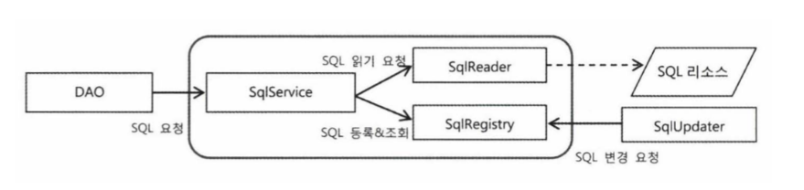
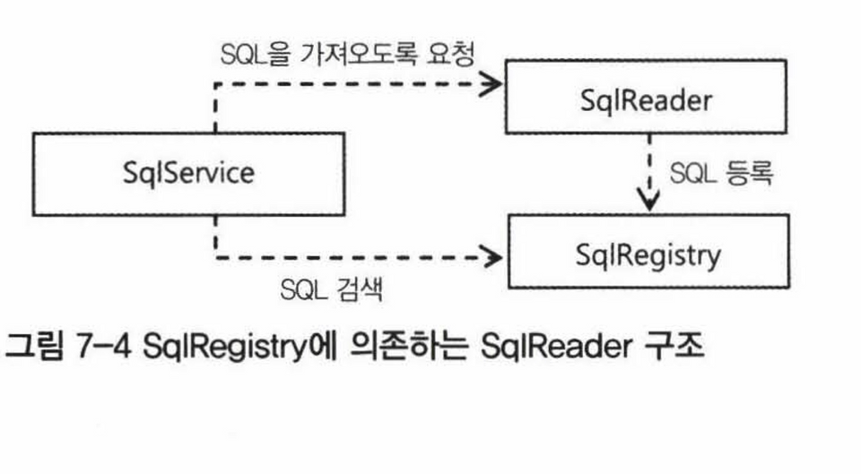

# 7장 스프링 핵심기술의 응용

## 7.1 SQL과 DAO의 분리
---
* userDao의 경우 충분한 개선이 이뤄졌었지만, 테이블이 바뀔 때 마다 SQL문장을 담고있는 DAO에 수정이 발생할것이다.

### 7.1.1 XML 설정을 이용한 분리
  * 개별 SQL 프로퍼티 방식
    * SQL을 xml설정파일의 프로퍼티 값으로 정의해서 DAO에 주입
    * 새로운 SQL이 필요할 때마다 프로퍼티를 추가하고 DI를 위한 변수와 수정자 메소드도 만들어줘야한다.
```java
<bean id="userDao" class="springbook.user.dao.UserDaoJdbc">
    <property name="dataSource" ref="dataSource" />
    <property name="sqlAdd" value="insert into ..." />
</bean>
```
  * SQL 맵 프로퍼티 방식
    * SQL을 하나의 컬렉션으로 담아두는 방법으로 설정파일의 맵 정보만 변경하면 된다.
```java
<bean id="userDao" class="springbook.user.dao.UserDaoJdbc">
    <property name="dataSource" ref="dataSource" />
    <property name="sqlMap">
              <map>
                  <entry key="add" value="insert into users(id, name, password, level, login, recommend, email) values(?,?,?,?,?,?,?)" />
                  <entry key="get" value="select * from users where id = ?" />
                  ...
              </map>
    </property>
</bean>
```
### 7.1.2 SQL 제공 서비스
  * SQL 서비스 인터페이스
    * 데이터 액세스 로직의 일부인 SQL 문장을 애플리케이션 구성정보를 가진 설정정보와 함께 두는 건 바람직하지 못하다
    * XML은 런타임엔 변경이 어렵다는 점을 감안하면, SQL을 제공하는 기능을 담당하는 별도의 서비스로 독립시킬 필요가 있다.
    * SqlService에 XML로 주입을 하던, 다른 방법으로 주입을 하던 빈을 DI해주기만 하면 된다.
```java
public interface SqlService {
    String getSql(String key) throws SqlRetrievalFailureException;
}


public class UserDaoJdbc implements UserDao {
  ...
  private SqlService sqlService;

  public void setSqlService(SqlService sqlService) {
    this.sqlService = sqlService;
  }

  public void add(User user) {
    this.jdbcTemplate.update(this.sqlService.getSql("userAdd"), ...);
  }
}
```

<br/>

## 7.2 인터페이스의 분리와 자기참조 빈
---
### 7.2.1  xml 파일 매핑
* 스프링의 XML 설정파일에 SQL 정보를 넣어놓고 활용하는 건 좋은 방법이 아니다. 
  그보다는 SQL을 저장해두는 전용 포맷을 가진 독립적인 파일을 이용하는 편이 바람직하다.
 
* XML에 담긴 정보를 파일에서 읽어오는 방법은 다양하다. 
  JAXB(Java Architecture for XML Binding)은 가장 간단하게 사용할 수 있는 방법 중 하나이다. 
  DOM과 같은 전통적인 XML API와 비교했을 때 JAXB의 장점은 XML 문서정보를 거의 동일한 구조의 오브젝트로 직접 매핑해준다는 것이다.
 
* XML 문서를 읽어서 자바의 오브젝트로 변환하는 것을 JAXB에서는 언마샬링(unmarshalling)이라고 부른다. 
  반대로 바인딩 오브젝트를 XML 문서로 변환하는 것은 마샬링(marshalling)이라고 한다.
### 7.2.2  xml 파일을 이용하는 SQL 서비스
* DAO가 sql 요청할 때마다 매번 xml파일을 다시 읽는건 비효율적. 한번 읽은건 어딘가에 저장해두고 DAO에서 요청이 올 때 사용해야한다.
* 처음 SQL을 읽어들이는걸 우선은 생성자에서 하고 동작하게 만들어보자. 변환된 SQL오브젝트는 맵에 저장해놨다가 DAO요청이 오면 전달하는 방식으로.
```java
public class XmlSqlService implements SqlService {
    private Map<String, String> sqlMap = new HashMap<String, String>(); // 읽어온 SQL을 저장해둘 맵
    
    public XmlSqlService() {    // 생성자에서 xml읽어오기
        String contextPath = Sqlmap.class.getPackage().getName();
        try {
            JAXBContext context = JAXBContext.newInstance(contextPath);
            Unmarshaller unmarshaller = context.createUnmarshaller();
            InputStream is = UserDao.class.getResourceAsStream("sqlmap.xml");
            Sqlmap sqlmap = (Sqlmap)unmarshaller.unmarshal(is);
            for(SqlType sql : sqlmap.getSql()) {
                sqlMap.put(sql.getKey(), sql.getValue()); // 읽어온 SQL을 맵으로 저장해둔다.
            }
        } catch (JAXBException e) {
            throw new RuntimeException(e);
        }
    }

  ...

}
```
### 7.2.3 빈의 초기화 작업
* 생성자에서 예외가 발생할 수 있는 복잡한 초기화 작업을 다루는건 좋지 않다.
* xml 파일 위치, 이름이 코드에 고정 - 로직이 바뀔 가능성이 있는 내용은 외부에서 DI로 설정할 수 있게 해야한다. 
```java
public class XmlSqlService implements SqlService {
   @PostConstruct // 빈생성 후 초기화 메서드 등록
   public void loadSql() {....}
}
```
* 생성자 대신에 loadSql()처럼 초기화 메서드를 사용하고, 파일이름과 위치는 외부에서 DI로 설정하게끔 수정하자.
* @PostConstruct 애노테이션을 통해 초기화 메서드로 지정해줄 수 있다.

### 7.2.4 인터페이스 분리
* SQL을 가져오는 방법이 특정 기술에 고정되어있다. 다른 포맷의 파일에서 읽어와야하는 요구사항이 생기면 XmlSqlService를 직접 수정해야한다.
* 가져온 SQL정보를 새로운 방식으로 저장하고 검색해서 가져오려면 XmlSqlService를 직접 수정해야한다.


  1. SQL 정보를 외부 리소스로부터 읽어오는 책임
  2. 읽어온 SQL을 보관해두고 있다가 필요할 때 제공하는 책임
  3. 한번 가져온 SQL을 필요에 따라 수정

* SqlReader는 읽어온 다음에 SqlRegistry에 전달해서 등록되게 해야하는데
  * 위 그림처럼 SqlService가 SqlReader에게 데이터를 달라고 요청하고, 그것을 다시 SqlRegistry에 전달하는 방식은 불필요하게 service를 거치게 된다.
  * SqlReader에게 SqlRegistry 오브젝트를 전달해서 저장하라고 요청하는게 좋다. SqlRegistry가 일종의 콜백 오브젝트처럼 사용된다.
  ```java
  sqlReader.readSql(sqlRegistry);
  ```

  
### 7.2.5 자기참조 빈으로 시작하기
* 책임에 따라 분리되지 않았던 XmlSqlService 클래스를 세분화된 책임을 정의한 인터페이스(SqlReader, SqlService, SqlRegistry)로 구현
  

```java
<bean id="sqlService" class="{{classpath}}">
  <property name="sqlReader" ref="sqlService" /> // 자기 자신을 참조한다!
  <property name="sqlRegistry" ref="sqlService" /> 
  <property name="sqlmapFile" value="sqlmap.xml" />
</bean>
```
* 자기 자신을 참조하는 빈은 사실 흔히 쓰이는 방법은 아니다. 
* 책임과 관심사가 복잡하게 얽혀 있어서 확장이 힘들고 변경에 취약한 구조의 클래스를 유연한 구조로 만들려고 할 때 처음 시도해볼 수 있는 방법이다.    
* 당장 확장구조를 이용해 구현을 바꿔 사용하지 않더라도 확장구조를 만들어두는 게 좋다고 생각할 때 가장 간단히 접근할 수 있는 방법이기도 하다.

### 7.2.6 디폴트 의존관계
* 위의 자기참조 빈에서 독립적인 빈으로 나눌경우 
  클래스가 늘어나고 의존관계 설정도 다 해줘야하는 부담이 있음
* DI를 사용한다고 해서 항상 모든 프로퍼티 값을 설정에 넣고 모든 의존 오브젝트를 일일이 빈으로 지정할 필요 없다. 
  자주 사용되는 오브젝트는 디폴트 의존관계를 갖는 빈을 만들어보자.
  ```java
    public class DefaultSqlService extends BaseSqlService{
      public DefaultSqlService() { // 생성자에서 자신이 사용할 디폴트 의존 오브젝트를 스스로 DI.
          setSqlReader(new JaxbXmlSqlReader());
          setSqlRegistry(new HashMapSqlRegistry());
      }
    }
  ```

## 7.3 서비스 추상화 적용
* JaxbXmlSqlReader를 발전시켜보자
  * JAXB가 표준에 포함된 라이브러리지만 그 외에도 다양한 XML - 자바오브젝트 매핑 기술(OXM)이 있다. 
  * XML파일을 클래스패스 말고 절대경로, http프로토콜 등 다양한 소스에서 가져올 수 있게 하기
* OXM추상화
  * SqlReader는 xml을 자바오브젝트로 변환하는 Unmarshaller 인터페이스가 필요하다.
  * 프로퍼티에 contextPath를 지정해 바인딩 클래스의 패키지를 지정하여 사용한다.
  * 그저 빈을 만들어 주입하고, unmarshal() 메서드를 호출하면 끝이다. oxm 기술이 바뀌더라도 Unmarshaller 타입의 변수를 주입받는 입장에선 코드가 바뀔 일이 없다
  ```java
  public interface Unmarshaller {
              ...
    Object unmarshal(Source source) throws IOException, XmlMappingException;
  }
  ```
* 추상화된 OXM 기능을 이용하는 SqlService 구현
  * 서비스 추상화를 이용할 때 계속 빈이 늘어나고 반복되는 DI구조가 불편하고 
  * 디폴트 의존 오브젝트는 외부에서 프로퍼티를 지정해주기가 어려기 때문에
  * 하나의 빈 설정만으로 SqlService와 SqlReader의 필요한 프로퍼티 설정이 모두 가능하도록 만들기.
  ```java
  public class OxmSqlService implements SqlService {
      private final OxmSqlReader oxmSqlReader = new OxmSqlReader();
      private class OxmSqlReader implements SqlReader {
                ...
      }
  }
  ```
* Resource 추상화
  * 자바에서는 http, ftp, file, 클래스패스 내 리소스 등 다양한 리소스에 일관성 있게 접근할 수 있는 방법이 없다. 
  * 그래서 스프링에선 Resource라는 추상화 인터페이스를 정의했다.
  * 스프링에서는 리소스의 종류와 위치를 함께 표현하여 이 문자열 리소스 주소를 실제 Resource 타입 오브젝트로 반환하는 ResourceLoader를 제공한다.
  ```java
  <property name="myFile" value="classpath:com/e/mypj/data/myfile.txt" />
  <property name="myFile" value="file:/data/myfile.txt" />
  <property name="myFile" value="https://www.adfjkdlfjlk.com/myfile.txt" />
  ```
  * ResourceLoader의 대표적인 예는 바로 스프링의 애플리케이션 컨텍스트다. 애플리케이션 컨텍스트가 구현해야 하는 인터페이스인 ApplicationContext는 ResourceLoader 인터페이스를 상속하고 있다. 따라서 모든 애플리케이션 컨텍스트는 리소스로더이기도 하다.
  ```java
  private class OxmSqlReader implements SqlReader {
        private Unmarshaller unmarshaller;
        private static final String DEFAULT_SQLMAP_FILE = "sqlmap.xml";
        private Resource sqlmap = new ClassPathResource(DEFAULT_SQLMAP_FILE, UserDao.class);
        
        public void setSqlmap(Resource sqlmap) {
            this.sqlmap = sqlmap;
        }
        public void read(SqlRegistry sqlRegistry) {
            try {
                Source source = new StreamSource(sqlmap.getInputStream());
                        // 리소스 종류에 상관없이 스트림으로 가져올 수 있다.
            ...
            }
        }
  }

  <bean id="sqlService" class="springbook.user.sqlservice.OxmSqlService">
    <property name="sqlMap" value="classpath:springbook/user/dao/sqlmap.xml" />
    // 프로퍼티의 value 부분을 file: 또는 http: 접두어로 바꿔서 다른 데서 가져올 수 있다
      ...
  </bean>
  ```

  ## 스프링 3.1의 DI

  ### 1.xml을 어노테이션과 자바코드로 대체하기
* @ContextConfiguration은 스프링 테스트가 DI 정보를 어디서 가져와야할 지 지정하는 어노테이션이다.
* DI 정보로 사용될 자바 클래스를 만들 때 @Configuration 어노테이션을 사용한다. 해당 어노테이션이 붙은 클래스는 앞으로 XML을 대신하여 DI 설정정보로 이용될 것이다.
    ```java
    @Configuration
    public class TestAppicationContext{

    }

    // UserDaoTest.java
    //...
    @ContextConfiguration(classes=TestApplicationContext.class) // 이제 XML 대신 클래스에서 DI 설정을 찾는다.
    public class UserDaoTest{
            //...
    }
    ```
* <context:annotation-config /> 제거
  * xml을 쓸 때는 이 태그에 의해 등록되는 빈 후처리기가 @PostConstruct 와 같은 표준 애노테이션을 인식해서 자동으로 메서드를 실행한다.
  * @Configuration이 붙은 설정 클래스를 사용하는 컨테이너가 사용되면, 컨테이너가 직접 @PostConstruct 를 처리하는 빈 후처리기를 등록해준다.
* 빈의 전환
  * @Bean 이 붙은 public 메서드. 메서드 이름은 빈의 id.
  * 리턴값은 구현클래스보다 인터페이스로 해야 DI에 따라 구현체를 자유롭게 변경할 수 있다.
  * 메서드 내부에서는 빈의 구현 클래스에 맞는 프로퍼티 값 주입이 필요함.
  ```java
  Copycopy code to clipboard
  @Bean
      public DataSource dataSource() {
          SimpleDriverDataSource dataSource = new SimpleDriverDataSource ();
                      ...
          return dataSource;
  }
  ``` 
* Spring 3.1은 xml에서 자주 사용되는 전용 태그를 @Enable로 시작하는 애노테이션으로 대체할 수 있도록 애노테이션을 제공한다. 
  * ex. <tx:annotation-driven /> → @EnableTransactionManagement

### 2.빈 스캐닝과 자동 와이어링
* 자동 와이어링
  * 자동와이어링을 이용하면 컨테이너가 이름/타입 기준으로 주입될 빈을 찾기 때문에 프로퍼티 설정을 직접 해주는 코드를 줄일 수 있다.
  * DI 관련 코드를 대폭 줄일 수 있음
* @Component
  * 클래스에 붙이면 빈 스캐너를 통해 자동으로 빈으로 등록될 대상이 된다.
  * @Component annotation이 달린 클래스를 자동으로 찾아 빈으로 등록해주게 하려면 빈 스캔 기능을 사용하겠다는 annotation 정의가 필요
  ```java
  @ComponentScan(basePackages="springbook.user")
  public @interface Service { // annotation은 @interface 키워드로 정의한다.
  ...
  }
  ```

### 3.컨텍스트 분리와 @Import
* 컨텍스트 분리
  * 성격이 다른 DI정보를 분리
  * @Configuration 이 붙은 빈 설정 파일을 테스트에만 쓰이는 설정(AppContext)과 실서비스 동작 시 쓰이는 설정(TestAppContext) 두가지로 분리
  ```java
  @ContextConfiguration(classes={TestAppContext.class, AppContext.class})
  public class UserDaoTest { ... }
  ```
* @Import
  * SQL서비스처럼 다른 애플리케이션에서도 사용할 수 있고, 독립적으로 개발/변경될 가능성이 높은 서비스는 독립적인 모듈처럼 취급하는게 좋다.
  ```java
  @Import(SqlServiceContext.class)
  public class AppContext { ... }
  ``` 

### 4.프로파일
  * 테스트와 운영환경에서 각기 다른 빈 정의가 필요한 경우
  * 양쪽 모두 필요하면서 내용만 다른 것들은 설정정보를 변경하고 조합하는 것으로는 한계
  * 실행환경에 따라 빈 구성이 달라지는 내용을 프로파일로 정의해서 만들어두고, 실행시점에 지정해서 사용
  * context를 쓰는곳에서 active profile을 지정
  ```java
  @Configuration
  @Profile("test")
  public class TextAppContext { ... }

  @ActiveProfiles("test")
  @ContextConfiguration(classes=AppContext.class)
  public class UserServiceTest { ...}
  ```